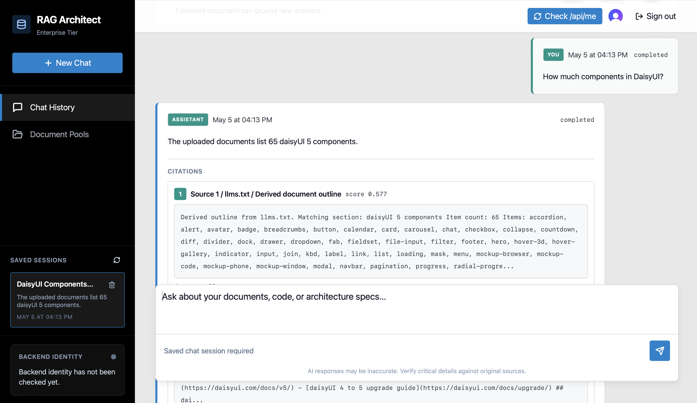

# RAG Service

FastAPI, Vue, Clerk, Postgres/pgvector, MinIO, and Pydantic AI working together as a small internal RAG workspace. Authenticated users upload shared documents, ask grounded questions, keep their own chat sessions, and review source citations returned with each answer.



## What It Does

- Clerk-backed sign in, sign up, and sign out.
- Protected FastAPI API with local `app_users` projection for app-owned records.
- Shared document pool for `.txt`, `.md`, and `.pdf` uploads.
- Any authenticated user can deliberately delete any shared document.
- Background ingestion worker extracts text, chunks documents, creates embeddings, and writes retrieval-ready vectors.
- Postgres with pgvector stores documents, chunks, embeddings, chat sessions, messages, and citations.
- Pydantic AI rewrites conversational questions and generates source-grounded answers.
- Streaming chat returns `delta`, `final`, and `error` SSE events.
- Deterministic backend evals validate retrieval, citations, no-source behavior, deleted-document exclusion, and query rewrite wiring.

## Architecture

```text
Vue + Clerk
  |
  | Bearer Clerk session token
  v
FastAPI API
  |-- /api/me syncs local app user
  |-- /api/documents uploads, lists, tombstones shared documents
  |-- /api/chat/sessions stores user-owned sessions and streams answers
  |
  | metadata, chat, vectors
  v
Postgres + pgvector

MinIO stores original uploaded files.
Worker claims ingestion jobs with SKIP LOCKED, extracts text, chunks, embeds, and marks documents ready.
OpenAI-backed Pydantic AI services handle query rewrite and answer generation.
```

## Quickstart

Create local configuration:

```sh
cp .env.example .env
```

Fill these values in `.env`:

- `VITE_CLERK_PUBLISHABLE_KEY`
- `CLERK_JWT_PUBLIC_KEY`
- `OPENAI_API_KEY`

Start the full stack:

```sh
docker compose up --build
```

Open:

- Frontend: `http://localhost:5173`
- Backend health: `http://localhost:8000/health`
- MinIO console: `http://localhost:9001`

Compose also starts Postgres, runs Alembic migrations, creates the MinIO bucket, and starts the ingestion worker.

## Local Development

Backend:

```sh
docker compose up -d postgres minio minio-init
cd backend
uv sync
uv run alembic upgrade head
uv run uvicorn app.main:app --reload --host 0.0.0.0 --port 8000
```

Frontend:

```sh
cd frontend
npm install
npm run dev
```

## Checks

Run the main validation path:

```sh
make test
```

Useful focused checks:

```sh
make backend-test
make evals
make frontend-check
make e2e
```

The backend tests and evals use `TEST_DATABASE_URL` and refuse to run destructively against the main `DATABASE_URL`.

Advanced contract checks:

```sh
make e2e-clerk
make e2e-schema-capture
```

`e2e-clerk` validates the real Clerk/browser/backend auth contract when Clerk credentials are configured. `e2e-schema-capture` is opt-in for refreshing real document/chat API schema fixtures from a configured local stack.

## Configuration Notes

Core auth and runtime:

- `VITE_API_BASE_URL`
- `BACKEND_CORS_ORIGINS`
- `DATABASE_URL`
- `TEST_DATABASE_URL`
- `POSTGRES_DB`, `POSTGRES_USER`, `POSTGRES_PASSWORD`

RAG/OpenAI:

- `OPENAI_API_KEY`
- `OPENAI_BASE_URL`
- `CHAT_MODEL`
- `EMBEDDING_MODEL`
- `RAG_CHUNK_TARGET_TOKENS`, `RAG_CHUNK_OVERLAP_TOKENS`
- `RAG_QUERY_REWRITE_HISTORY_MESSAGES`, `RAG_ANSWER_HISTORY_MESSAGES`
- `RAG_RETRIEVAL_TOP_K`, `RAG_RETRIEVAL_MIN_SIMILARITY`

Storage and ingestion:

- `OBJECT_STORAGE_ENDPOINT`, `OBJECT_STORAGE_BUCKET`
- `OBJECT_STORAGE_ACCESS_KEY`, `OBJECT_STORAGE_SECRET_KEY`
- `OBJECT_STORAGE_REGION`, `OBJECT_STORAGE_SECURE`, `OBJECT_STORAGE_FORCE_PATH_STYLE`
- `MAX_UPLOAD_BYTES`, `MAX_EXTRACTED_CHARS`
- `INGESTION_WORKER_ID`, `INGESTION_MAX_ATTEMPTS`, `INGESTION_BASE_RETRY_SECONDS`
